# Helm ,AKS, Terraform Task Report made by: Valeriy Manuilyk, Liubomyr Shpyrka, Pavlo Mochurad
## First, we created a Terraform configuration

The terraform configuration looks like this:

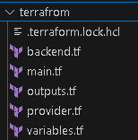

Let's take a closer look at each file:

* backend.tf:    
```hcl
#====================================================
# 🌟 Authors: Valeriy Manuilyk, Pavlo Mochurad, Liubomyr Shpyrka 🌟
#====================================================
# ⚙️ Terraform Configuration for Azure Backend ⚙️
# 📂 This configuration sets up the backend to store Terraform state 
# in an Azure Storage Account. 
# ✅ Ensure that the specified resource group, storage account, 
# and container exist before applying. 
# 🌐 GitHub: https://github.com/Pavlo165/BeStrong-Terrafrom
#====================================================

terraform {
  backend "azurerm" {
    resource_group_name  = "clustersupportresources"
    storage_account_name = "tfstateaccount4477"
    container_name       = "tfstate"
    key                  = "terraform.tfstate"
  }
}
```

* main.tf:    
```hcl
#====================================================
# 🌟 Authors: Valeriy Manuilyk, Pavlo Mochurad, Liubomyr Shpyrka 🌟
#====================================================
# 🌟 Terraform Configuration for Azure AKS Setup 🌟
#====================================================
# ⚙️ This script provisions an Azure Resource Group 
# and an Azure Kubernetes Service (AKS) cluster.
# ✅ Ensure variables (e.g., `var.resource_group_name`, `var.location`) 
# are properly set in your `terraform.tfvars` file or directly in variables.
# 📂 GitHub: https://github.com/Pavlo165/BeStrong-Terrafrom
#====================================================

# 📦 Creating a Resource Group
resource "azurerm_resource_group" "main" {
  name     = var.resource_group_name   # 🏷️ Name of the Resource Group
  location = var.location              # 🌍 Azure region where resources will be created
}

# 🚀 Provisioning an Azure Kubernetes Service (AKS) Cluster
resource "azurerm_kubernetes_cluster" "aks" {
  name                = var.aks_cluster_name                  # 🏷️ Name of the AKS Cluster
  location            = azurerm_resource_group.main.location  # 🌍 Inherited location from Resource Group
  resource_group_name = azurerm_resource_group.main.name      # 📦 Associated Resource Group
  dns_prefix          = "aks-${var.aks_cluster_name}"         # 🌐 DNS prefix for the AKS cluster

  # 🖥️ Node pool configuration
  default_node_pool {
    name       = "default"           # 🏷️ Name of the default node pool
    node_count = var.node_count      # 🔢 Number of nodes in the pool
    vm_size    = var.node_size       # 💻 VM size for the nodes
  }

 # 🛡️ Assigning System-Managed Identity
  identity {
    type = "SystemAssigned"
  }

  # 🏷️ Adding tags for resource organization
  tags = {
    environment = "dev"              # 🛠️ Environment tag (development)
  }
}
```

* outputs.tf:    
```hcl
#====================================================
# 🌟 Authors: Valeriy Manuilyk, Pavlo Mochurad, Liubomyr Shpyrka 🌟
#====================================================
# 🌟 Outputs for Azure AKS Configuration 🌟
#====================================================
# 📤 This section provides outputs to access AKS cluster details 
# and its Kubernetes configuration.
# 🚀 These outputs can be used for further automation or integration.
#====================================================

# 🏷️ Output: AKS Cluster Name
output "aks_cluster_name" {
  value = azurerm_kubernetes_cluster.aks.name   # 🏗️ Retrieves the name of the AKS cluster
}

# 📜 Output: Kubernetes Configuration (kubeconfig)
output "kube_config" {
  value     = azurerm_kubernetes_cluster.aks.kube_config_raw   # 📂 Full kubeconfig for accessing the cluster
  sensitive = true                                             # 🔒 Marks the output as sensitive to protect the config
}
```

* file  provider.tf:    
```hcl
#====================================================
# 🌟 Authors: Valeriy Manuilyk, Pavlo Mochurad, Liubomyr Shpyrka 🌟
#====================================================
# 🌍 Azure Provider Configuration 🌍
#====================================================
# 🛠️ This block configures the Azure Resource Manager (azurerm) provider.
# 🔑 Make sure the subscription ID corresponds to the correct Azure account.
# ⚡ Features block is left empty, but can be extended for advanced capabilities.
#====================================================

provider "azurerm" {
  features {}  # 🚀 Enables the default features for the azurerm provider
  
  subscription_id = "fdc51540-ce97-42ba-a64d-feb455570f4f"  # 🔑 Azure Subscription ID
}
```

* file variables.tf:    
```hcl
#====================================================
# 🌟 Authors: Valeriy Manuilyk, Pavlo Mochurad, Liubomyr Shpyrka 🌟
#====================================================
# 🌱 Input Variables for Azure Resources Configuration 🌱
#====================================================
# 🖥️ These variables allow you to customize the deployment of resources on Azure.
# 💡 Ensure to modify them based on your project needs.
#====================================================

# 📦 Resource Group Name
variable "resource_group_name" {
  description = "The name of the resource group"  # 🏷️ Name of the resource group in Azure
  type        = string
  default     = "bestrongcluster"  # 🌍 Default resource group name
}

# 🌍 Location of Resources
variable "location" {
  description = "The Azure region where resources will be created"  # 📍 Region where the resources will be deployed
  type        = string
  default     = "northeurope"  # 🌍 Default location
}

# 🧑‍💻 AKS Cluster Name
variable "aks_cluster_name" {
  description = "The name of the AKS cluster"  # 🏞️ Name of the Azure Kubernetes Service (AKS) cluster
  type        = string
  default     = "testcluster"  # 🧑‍💻 Default AKS cluster name
}

# 🖧 Number of Nodes in the AKS Cluster
variable "node_count" {
  description = "The number of nodes in the AKS cluster"  # 🔢 The total number of nodes in the AKS cluster
  type        = number
  default     = 2  # ⚙️ Default number of nodes is set to 2
}

# 💻 Size of the Nodes in AKS Cluster
variable "node_size" {
  description = "The size of the nodes in the AKS cluster"  # 🖥️ Size of the virtual machines (VMs) in the cluster
  type        = string
  default     = "Standard_DS2_v2"  # 💻 Default node size is Standard_DS2_v2
}
```

Our infrastructure is already in place, so let's see what it looks like in terraform:    
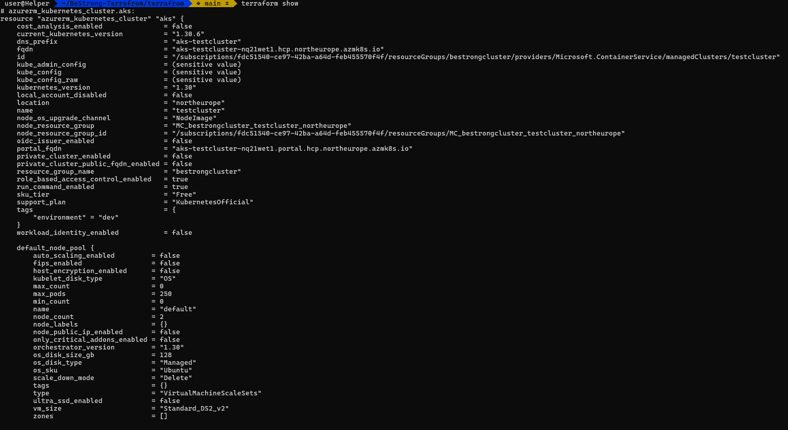
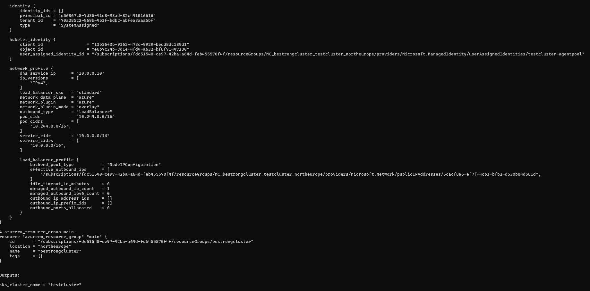
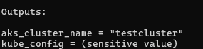

The result is in the openwork itself:    
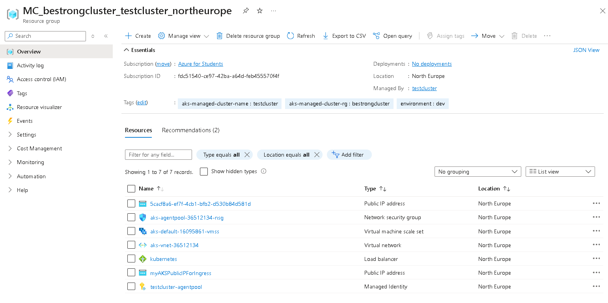

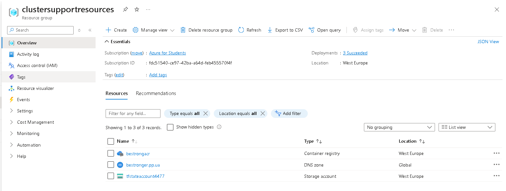

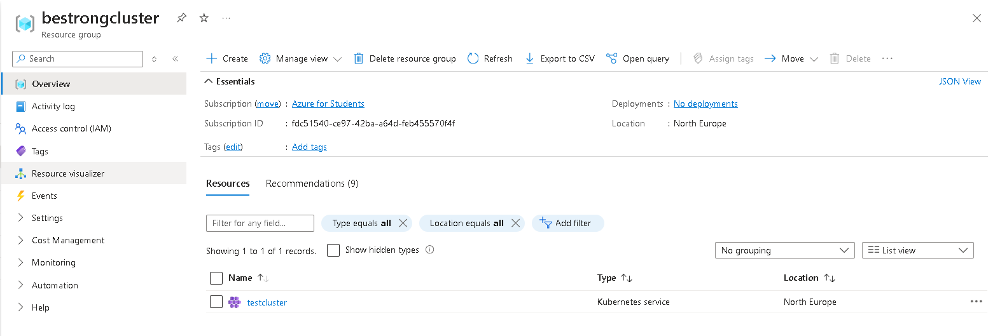

Let's go to our AKS cluster:    
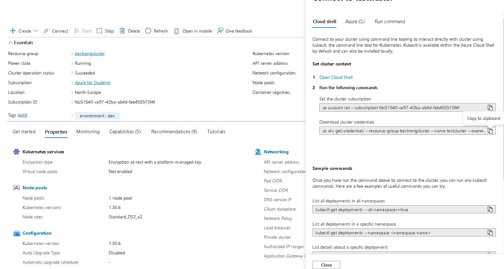

We can successfully enter our AKS cluster:    
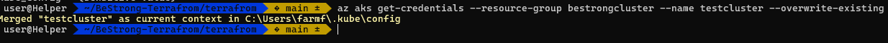

## Let's move on to the Helm configuration, it looks like this:    
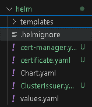

Go to the Templates directory:    
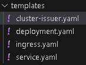

Let's take a closer look at each file:
* deployment.yaml:    
```yaml
apiVersion: apps/v1
kind: Deployment
metadata:
  name: {{ .Release.Name }}-stable
  labels:
    app: {{ .Chart.Name }}
    version: stable
spec:
  replicas: {{ .Values.replicaCount.stable }}
  selector:
    matchLabels:
      app: {{ .Chart.Name }}
      version: stable
  template:
    metadata:
      labels:
        app: {{ .Chart.Name }}
        version: stable
    spec:
      containers:
      - name: {{ .Chart.Name }}
        image: "{{ .Values.image.stable.repository }}:{{ .Values.image.stable.tag }}"
        imagePullPolicy: {{ .Values.image.stable.pullPolicy }}
        ports:
        - containerPort: {{ .Values.service.targetPort }}
      nodeSelector: {{ .Values.nodeSelector | toJson }}
      tolerations: {{ .Values.tolerations | toJson }}
      affinity: {{ .Values.affinity | toJson }}

---

apiVersion: apps/v1
kind: Deployment
metadata:
  name: {{ .Release.Name }}-canary
  labels:
    app: {{ .Chart.Name }}
    version: canary
spec:
  replicas: {{ .Values.replicaCount.canary }}
  selector:
    matchLabels:
      app: {{ .Chart.Name }}
      version: canary
  template:
    metadata:
      labels:
        app: {{ .Chart.Name }}
        version: canary
    spec:
      containers:
      - name: {{ .Chart.Name }}
        image: "{{ .Values.image.canary.repository }}:{{ .Values.image.canary.tag }}"
        imagePullPolicy: {{ .Values.image.canary.pullPolicy }}
        ports:
        - containerPort: {{ .Values.service.targetPort }}
      nodeSelector: {{ .Values.nodeSelector | toJson }}
      tolerations: {{ .Values.tolerations | toJson }}
      affinity: {{ .Values.affinity | toJson }}
```

* ingress.yaml:    
```yaml
apiVersion: networking.k8s.io/v1
kind: Ingress
metadata:
  name: {{ .Release.Name }}-ingress
  annotations:
    kubernetes.io/ingress.class: nginx
    nginx.ingress.kubernetes.io/canary: "{{ .Values.ingress.canary.enabled }}"
    nginx.ingress.kubernetes.io/canary-weight: "{{ .Values.ingress.canary.weight }}"
    cert-manager.io/cluster-issuer: letsencrypt-prod
spec:
  ingressClassName: nginx
  tls:
  - hosts:
    - {{ .Values.ingress.host }}
    secretName: {{ .Release.Name }}-tls # Cert-Manager автоматично створить цей секрет
  rules:
  - host: {{ .Values.ingress.host }}
    http:
      paths:
      - path: /
        pathType: Prefix
        backend:
          service:
            name: myapp
            port:
              number: {{ .Values.service.port }}
```
* service.yaml:    
```yaml
apiVersion: v1
kind: Service
metadata:
  name: myapp
  labels:
    app: myapp
spec:
  type: {{ .Values.service.type }}
  selector:
    app: myapp
  ports:
  - port: {{ .Values.service.port }}
    targetPort: {{ .Values.service.targetPort }}
  sessionAffinity: None

```

Next, install cert-manager and create a certificate using Let's Encrypt:
* cluster-issuer.yaml:    
```yaml
{{- if .Values.clusterIssuer.enabled }}
apiVersion: cert-manager.io/v1
kind: ClusterIssuer
metadata:
  name: {{ .Values.clusterIssuer.name }}
spec:
  acme:
    server: https://acme-v02.api.letsencrypt.org/directory
    email: {{ .Values.clusterIssuer.email }}
    privateKeySecretRef:
      name: {{ .Values.clusterIssuer.privateKeySecretName }}
    solvers:
    - http01:
        ingress:
          class: {{ .Values.clusterIssuer.ingressClass }}
{{- end }}
```

* certificate.yaml:    
```yaml
apiVersion: cert-manager.io/v1
kind: Certificate
metadata:
  name: bestrong-api-cert
  namespace: default
spec:
  secretName: bestrong-api-tls
  issuerRef:
    name: letsencrypt-staging
    kind: ClusterIssuer
  commonName: bestronger.pp.ua
  dnsNames:
  - bestronger.pp.ua
```

The result of the cert manager's work 
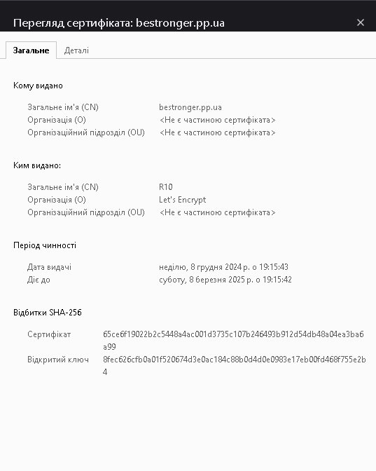

Let's see the results of the deployment:    
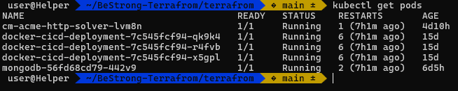

## Let's move on to CI/CD
This is how the structure looks like:    
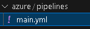

main.yaml:    
```yaml
variables:
- group: helm-pipeline

stages:
- stage: Build_And_Push_Helm
  displayName: "Build and Push Helm Charts to ACR"
  jobs:
  - job: PackAndPushHelm
    displayName: "Pack and Push Helm Charts to ACR"
    steps:
    - task: HelmInstaller@1
      displayName: "Install Helm"
      inputs:
        helmVersion: 'latest'

    - script: |
        helm lint ./helm
        helm package ./helm --version $(Build.BuildId) --destination ./artifacts
      displayName: "Lint and Pack Helm Charts"

    - task: AzureCLI@2
      displayName: "Login to Azure and push actifact"
      inputs:
        azureSubscription: "lnu_sub"
        scriptType: bash
        scriptLocation: inlineScript
        inlineScript: |
          az acr login --name $(ACR)
          export HELM_EXPERIMENTAL_OCI=1
          helm push ./artifacts/myapp-$(Build.BuildId).tgz oci://$(ACR).azurecr.io/helmrepo

- stage: Deploy_to_AKS
  displayName: "Deploy to AKS"
  dependsOn: Build_And_Push_Helm
  jobs:
  - job: Deploy
    displayName: "Deploy to AKS"
    steps:
    - task: AzureCLI@2
      displayName: "Login to AKS and ACR"
      inputs:
        azureSubscription: "lnu_sub"
        scriptType: bash
        scriptLocation: inlineScript
        inlineScript: |
          az aks get-credentials --resource-group $(resource-group) --name $(aks-cluster)
          az acr login --name $(ACR)

    - task: AzureCLI@2
      displayName: "Deploy with Helm"
      inputs:
        azureSubscription: "lnu_sub"
        scriptType: bash
        scriptLocation: inlineScript
        inlineScript: |
          export HELM_EXPERIMENTAL_OCI=1
          helm pull oci://$(ACR).azurecr.io/helmrepo/myapp --version $(Build.BuildId)
          helm upgrade --install myapp myapp-$(Build.BuildId).tgz
```

The result of Pipeline's work    
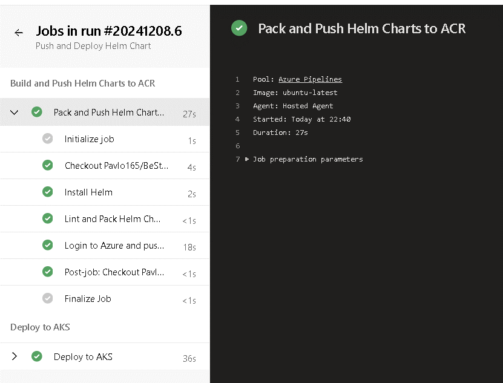
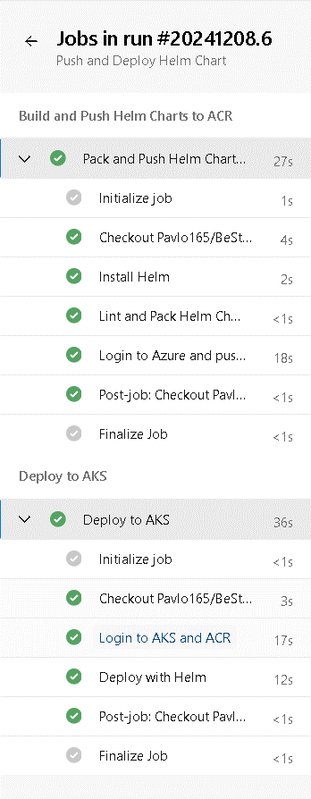

As you can see, with each commit to the repository, pipeline automatically packages the Helm chart, assigns a version based on the build number, packages it, saves it to the Azure container registry, and then deploys it.