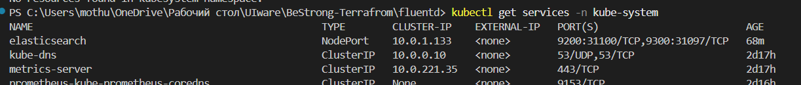
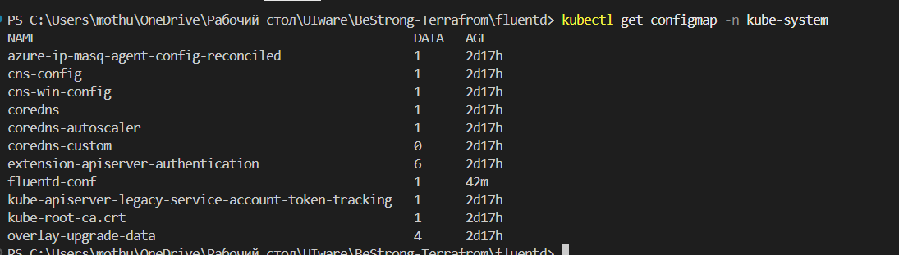
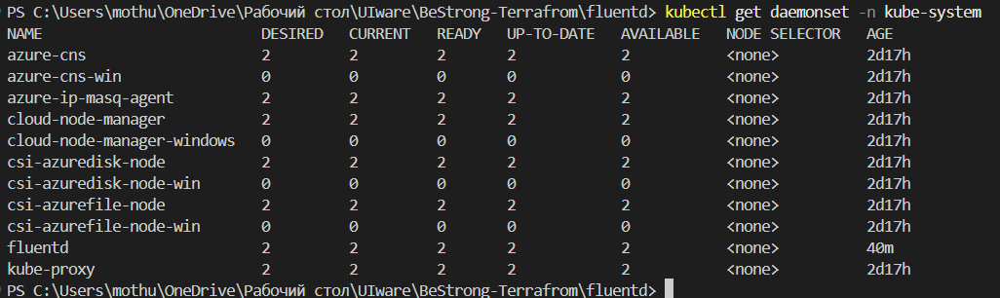
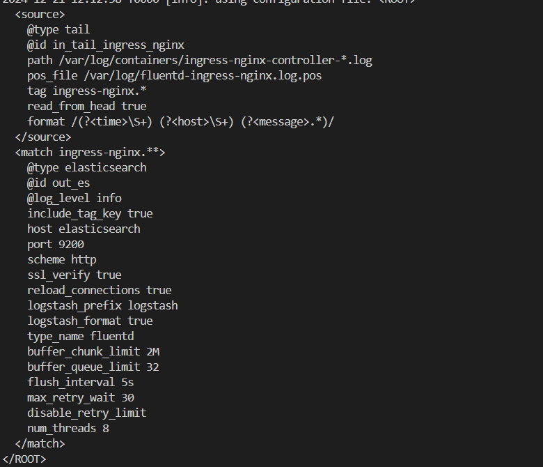
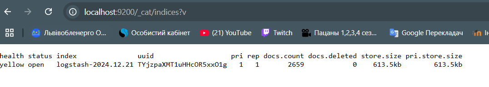
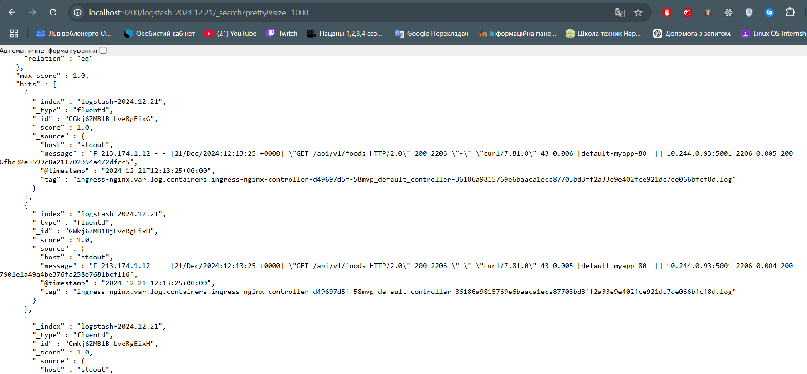
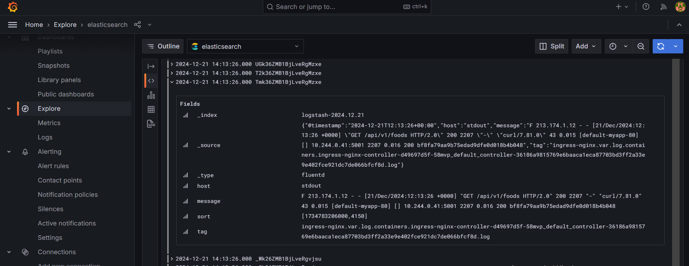

# REPORT "LOGGING WITH FLUEND"

To implement log collection for further storage and analysis. It is necessary to have a log collection system, with stdout of a specific pod, 
a place where those logs will be stored, as well as a utility for analysis. For these purposes, the following software will be used.

- **fluentd** - log collection
- **elasticsearch** - log storage
- **grafana** - visualization and analysis (although this is not the best choice for working with elasticsearch)

## Elasticsearch
To deploy Elasticsearch, I used the following YML configuration - `/fluentd/elasticsearch.yml`.  
This will create the necessary resources for Elasticsearch to work. Namely, the pod in which it will run and the endpoint for working with it via service.



## Fluentd
For it to work, you first need to create a role with the appropriate permissions.  
These permissions were created using the file `/fluentd/rbac.yml`.

After that, you can proceed to deploy Fluentd. It will be deployed as a DaemonSet.  
The file used for deployment is `/fluentd/fluentd-elasticsearch.yml`. The image used for this was compiled from `fluent/fluentd-kubernetes-daemonset:elasticsearch`, in which I additionally rewrote the standard configuration.

### Dockerfile
```dockerfile
FROM fluent/fluentd-kubernetes-daemonset:elasticsearch

# change default config
COPY fluent.conf /fluentd/etc/fluent.conf
```

In this configuration file, the path for storing logs is Elasticsearch. But the path for collecting logs is not configured.  
For this, I created a ConfigMap where I describe which pods should collect logs. This config file is `/fluentd/kubernetes.conf`.





### The configuration file inside the pod that was created


## Result

After deploying deamonset, logs were collected and sent to elasticsearch. For this, an index was created.
To access elasticsearch locally, I forwarded the port.


I reviewed the contents of index to verify the contents and make sure that log collection is working correctly.


### Grafana
The last step was to add elasticsearch as a data source in Grafana. And make sure that the logs are accessible in Grafana.

