# Task Report: Configuring Ingress, Alerts, and Kubecost in Kubernetes 🚀

## Step 1: Modify Helm Code for Ingress 🛠️

### Description
- The Ingress configuration was updated to route HTTP/HTTPS requests to Prometheus and Grafana services using the NGINX Ingress Controller.
- TLS certification was enabled using cert-manager with Let's Encrypt for secure connections.
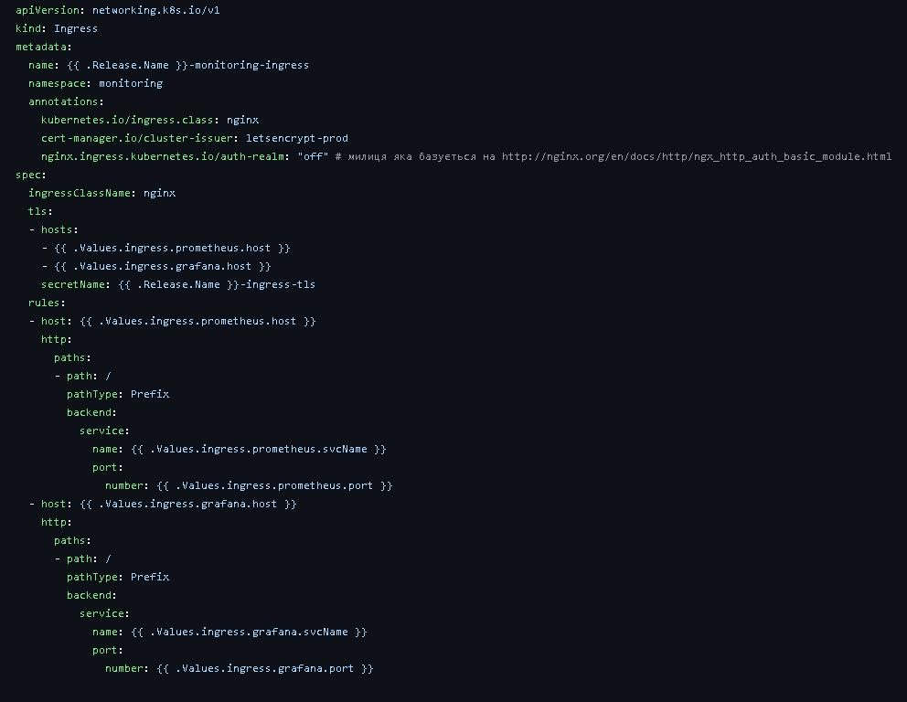

### Kubecost Ingress
- Configured Ingress for the Kubecost service.
- Enabled TLS and basic authentication via the `kubecost-basic-auth` secret.

## Step 2: Install Prometheus and Grafana 📈
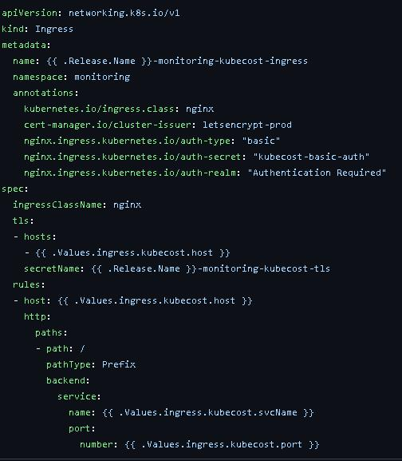
### Description
- Prometheus and Grafana were deployed in the Kubernetes cluster.
- Ingress configurations for both services were applied with HTTPS enabled.

### Next Steps
- After deployment, the next step was to set up alerts in Prometheus.

### https://grafana.bestronger.pp.ua/

## Step 3: Configure Prometheus Alerts ⚠️

### File Creation
- A separate file `alerts.yaml` was created to define custom Prometheus rules.
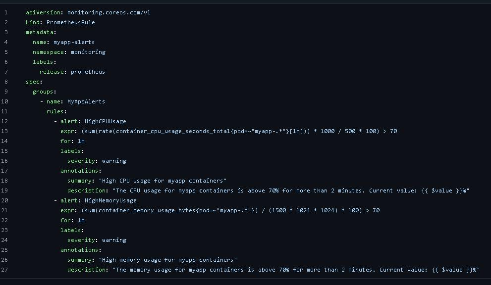
### Alert Rules
1. **HighCPUUsage**:
   - Triggered when the CPU usage of containers matching `myapp-.*` exceeds 70% for more than 1 minute.
   - Provides a summary and a description with the current metric value.
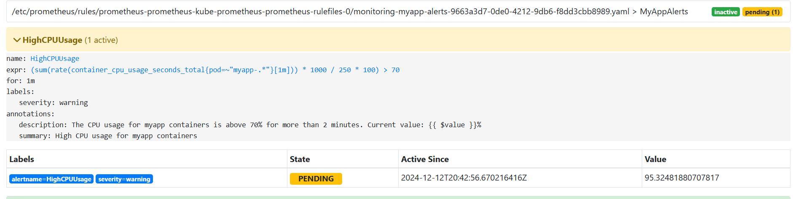
2. **HighMemoryUsage**:
   - Triggered when memory usage of the same containers exceeds 70% of 1.5GB for more than 1 minute.
   - Includes annotations for summary and description with the current metric value.

## Step 4: Test Alerts 🧪

### Cluster Load Test
- The cluster was intentionally loaded to validate if the alerts function as expected.

### Grafana Integration
- Verified that Grafana dashboards correctly displayed the alerts and provided detailed insights.
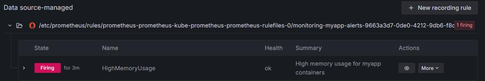
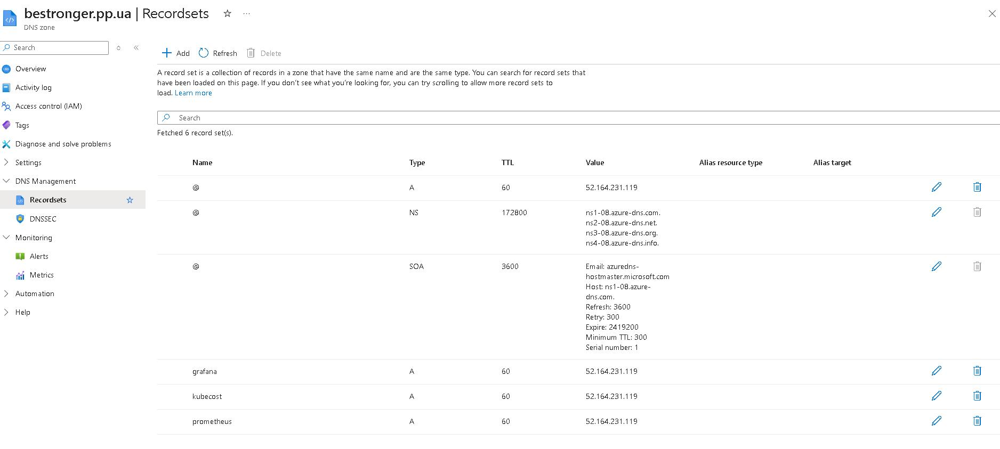
## Step 5: DNS Configuration in Azure 🌐

### Add A-Records
- Added A-records in Azure for Prometheus and Kubecost to enable domain-based access.

## Step 6: Install and Configure Kubecost 💰

### Installation
- Kubecost was installed in the Kubernetes cluster with the previously configured Ingress.
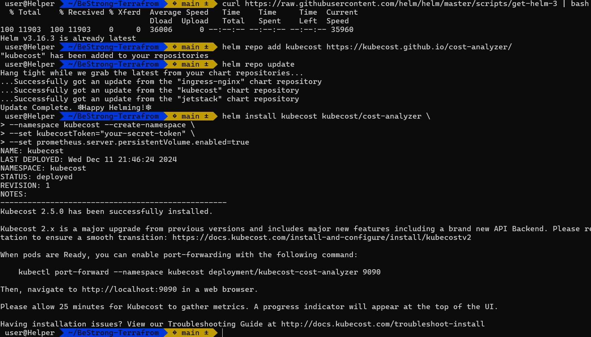
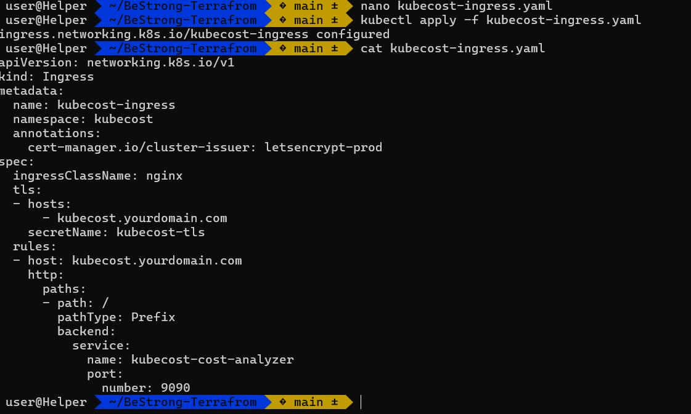
### Access
- Logged into the Kubecost application using basic authentication credentials.

### https://kubecost.bestronger.pp.ua/overview
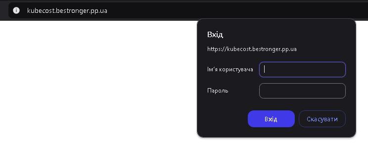
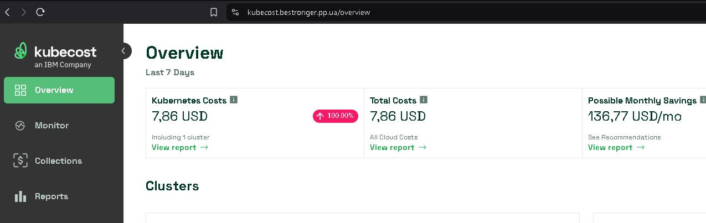
### Alert Configuration
- Configured alerts within Kubecost via the Microsoft Teams integration using the web UI.
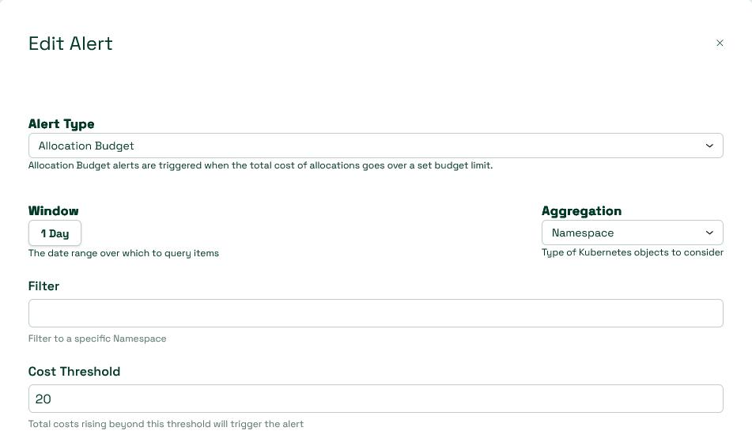

## Validation ✅
- Verified that all services (Prometheus, Grafana, Kubecost) were accessible and functioning as expected.
- Confirmed that alerts were triggered and displayed correctly in Grafana and Kubecost dashboards.
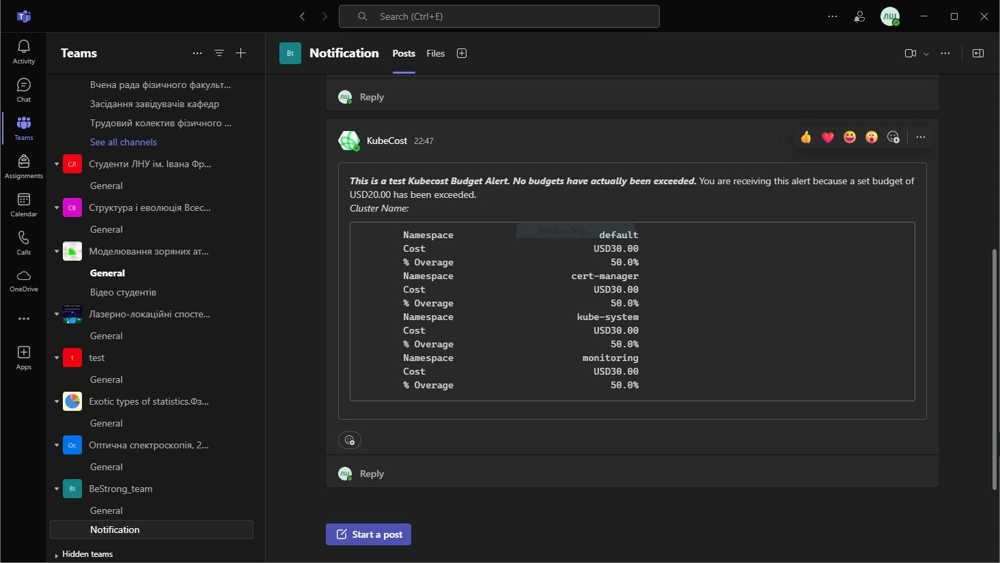
---

### Notes:
- TLS certification and secure access were successfully implemented.
- The environment is ready for production monitoring and alerting.
